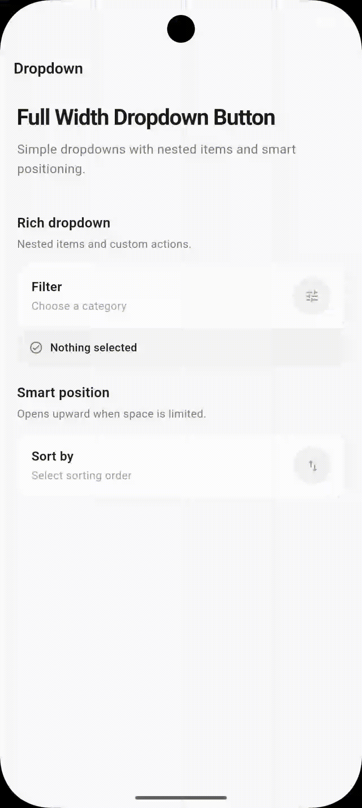

# full_width_dropdown_button

A polished, animated full-width dropdown for Flutter with nested submenus,
smart overlay positioning, rich leading widgets, hover feedback, and a
thread-style connector for child actions.

## Screenshot



## Features

- Full-width overlay menu with configurable trigger width/height
- Opens **below first** and flips above only when there is not enough space
- Menu stays attached to the trigger while the page scrolls
- Flat string API and rich nested-item API
- Nested animated submenus
- `Widget` leading content for icons, SVGs, avatars, etc.
- Destructive parent and sub-items
- Mouse hover states for desktop/web
- Haptic feedback on supported platforms
- Custom trigger widget or SVG asset trigger
- Smooth scale, fade, slide, and expansion animations

## Installation

```yaml
dependencies:
  full_width_dropdown_button: ^0.1.1
```

Then import:

```dart
import 'package:full_width_dropdown_button/full_width_dropdown_button.dart';
```

## Simple usage

```dart
FullWidthDropdownButton(
  child: const Icon(Icons.tune_rounded),
  items: const ['Newest', 'Oldest', 'Popular'],
  onSelected: (value) {
    debugPrint(value);
  },
)
```

## Rich nested usage

```dart
FullWidthDropdownButton.rich(
  child: const Icon(Icons.filter_alt_rounded),
  dropdownItems: [
    const DropdownItem(
      label: 'Food type',
      leading: Icon(Icons.restaurant_rounded, size: 16),
      subItems: ['Soup', 'Grill', 'Stir-fry'],
    ),
    const DropdownItem(
      label: 'Meat',
      leading: Icon(Icons.lunch_dining_rounded, size: 16),
      subItems: [
        DropdownSubItem(label: 'Beef'),
        DropdownSubItem(label: 'Chicken'),
        DropdownSubItem(label: 'Remove filter', isDestructible: true),
      ],
    ),
    const DropdownItem(label: 'Popular'),
    const DropdownItem(
      label: 'Clear all',
      isDestructible: true,
      leading: Icon(Icons.delete_outline_rounded, size: 16),
    ),
  ],
  onItemSelected: (parent, sub) {
    debugPrint(sub == null ? parent : '$parent > $sub');
  },
)
```

## SVG trigger

If you prefer an asset path instead of a custom trigger widget:

```dart
FullWidthDropdownButton(
  iconAsset: 'assets/filter.svg',
  items: const ['A', 'B', 'C'],
  onSelected: debugPrint,
)
```

Remember to register the asset in your app's `pubspec.yaml`.

## Styling the trigger

```dart
FullWidthDropdownButton.rich(
  width: 52,
  height: 52,
  padding: const EdgeInsets.all(14),
  decoration: BoxDecoration(
    color: Colors.grey.shade100,
    borderRadius: BorderRadius.circular(100),
  ),
  openDecoration: BoxDecoration(
    color: Colors.black,
    borderRadius: BorderRadius.circular(100),
  ),
  iconColor: Colors.grey,
  openIconColor: Colors.white,
  child: const Icon(Icons.menu_rounded),
  dropdownItems: const [DropdownItem(label: 'Option')],
  onItemSelected: (parent, sub) {},
)
```

## Notes

The menu width uses the current screen width with a 16 px horizontal margin.
The initial placement calculation intentionally uses the collapsed parent-row
height. This keeps the dropdown down-first instead of flipping upward merely
because a submenu *could* later expand.

## License

MIT
